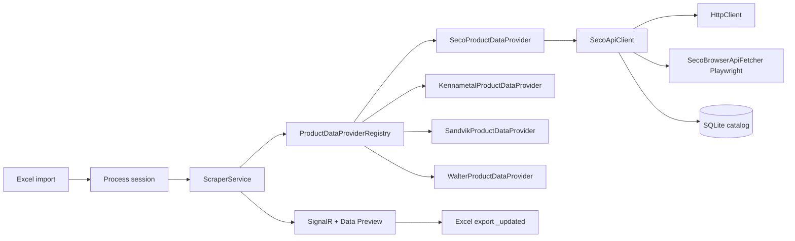

# Auto Tool Catalog

**Version 2.3.x** · Developed by UPECA PDC

A web application that enriches tooling Excel databases with supplier product data. It imports your catalog, fetches specifications from official supplier APIs (with a browser bridge where HTTP is blocked), stores raw JSON in SQLite, and exports an updated workbook with **dynamic property columns** per supplier.

## Features

- Import Excel (`.xlsx`) with thousands of tooling rows
- Live **Data Preview** table with fixed core columns plus dynamically discovered spec columns (`SECO_DC`, `SECO_APMX`, …)
- **Process / Fetch Specs** — concurrent supplier lookups with real-time progress (SignalR)
- **SECO** — full API pipeline; designation-only rows use Playwright site search when no Link column is present
- **Kennametal** — product-config CAD API (`product-config.net`); `KENN_*` columns from CAD parameters
- **Sandvik** — Coromant product search API; `SAND_*` columns from product detail properties
- **Walter** — Walter product search API; `WALT_*` columns from product `columns` + `items[]`
- Progress panel shows **Success / Failed / Current** and elapsed **Time** (`hh:mm:ss`) while processing
- Export completed Excel as `{original_name}_updated.xlsx` (formatted table, hyperlinks on Link)
- Stop processing mid-run; SignalR reconnect re-joins the session

## Tech Stack

| Layer | Technology |
|--------|------------|
| Runtime | .NET 10, ASP.NET Core Razor Pages |
| UI | Bootstrap 5, SignalR |
| Excel | ClosedXML |
| Catalog storage | SQLite (`Data/catalog.db`) |
| SECO data | HTTP client + **Playwright** (Chromium) when APIs return 405 or product must be resolved by search |

## Architecture (v2.0)

The app no longer scrapes HTML with HtmlAgilityPack. Each supplier is handled by a **product data provider** that returns normalized key/value properties.



### SECO pipeline

```
Procurement channel / Link / Tool Description
        ↓
Resolve item number (link → master list → 8-digit ID → search APIs → browser site search)
        ↓
GetFullProduct JSON (HTTP, or capture from product page in Chromium)
        ↓
Save raw JSON → SQLite (raw_products)
        ↓
Normalize Attributes[] → SECO_{Name} columns
        ↓
Save attributes → SQLite (product_attributes)
        ↓
Merge into session → UI + export
```

**Master list** (`Data/SECO_GLOBAL_ID.xlsx`, ~1,000 tools) is seeded once into a SQLite table (`seco_global_ids`) and loaded into an in-memory dictionary at startup (`SecoGlobalIdStore`). A `Tool Description → Seco Global Number` hit resolves the item number with no network call, so even rows without a Link skip the slow site search. The Excel is re-seeded only when it changes (a length+mtime signature is stored in `app_meta`).

**Browser bridge** is still used because direct `GET` to `GetFullProduct` returns **405** outside the site. The app keeps **one shared Chromium** instance and fetches JSON via in-page `fetch` (fast when an item number or Link is known).

| SECO row type | Typical speed (shared browser) |
|---------------|--------------------------------|
| Link, 8-digit item, or master-list match | ~2–7 s per row after warmup |
| Designation that misses Link **and** master list | ~30–90 s per row (site search + product load) |

To add coverage, append rows to `Data/SECO_GLOBAL_ID.xlsx` (columns: `Seco Global Number`, `Tool Description`); the table re-seeds on next startup. Rows that miss everything fall back to a single serialized browser gate; other suppliers stay on HTTP APIs.

### Kennametal pipeline

```
Link (…5672870.html) or Tool Description (e.g. 5720VZ16-A063Z4R)
        ↓
Resolve numeric product ID (URL → Hybris search API → HTML search → Playwright fallback)
        ↓
GET https://www.product-config.net/catalog3/cad?d=kennametal&id={productId}
        ↓
Pair attributes[] with attributeValues[] → KENN_{cadParameterName}
        ↓
SQLite + UI + export
```

Hybris search (ISO catalog number → product `code`):  
`GET https://www.kennametal.com/ws/v2/kmt/products/search?query={part}:relevance&fields=FULL`

Product pages look like:  
`https://www.kennametal.com/us/en/products/p.5720-series-shell-mill-metric.5672870.html`

### Sandvik pipeline

```
Link (…m=8917817) or Tool Description
        ↓
Resolve material ID (URL → autocomplete API by order code)
        ↓
GET https://www.sandvik.coromant.com/api/productsearch/product?id={materialId}
        ↓
Map properties[] (isDetails) → SAND_{title} with units
        ↓
SQLite + UI + export
```

Product pages look like:  
`https://www.sandvik.coromant.com/en-gb/product-details?c=1K354-1000-XD%201730&m=8917817`

### Walter pipeline

```
Link (/search/product/{id}) or Tool Description (first token, lowercased)
        ↓
GET https://www.walter-tools.com/api/productsearch/getproduct?id={id}&measurementUnit=Metric&language=en-gb
        ↓
Require hitCount > 0; map columns[] (showInDetails/showInList) → WALT_{title} from first items[]
        ↓
SQLite + UI + export
```

Product pages look like:  
`https://www.walter-tools.com/en-gb/search/product/dc180-05-05.500a1-wj30ez`

Ordering codes in Excel (e.g. `DC165-05-08.000A1-WJ30UU`, `F2162-8`, `A3289DPL-12`) are passed as lowercase `id` values. If Walter returns `hitCount: 0`, the row fails with **Walter product not found**.

### Dynamic columns

| Supplier | Column prefix | Status |
|----------|----------------|--------|
| SECO | `SECO_` | Live API + browser fallback |
| KENNAMETAL | `KENN_` | Live CAD API (`product-config.net/catalog3/cad`) |
| SANDVIK | `SAND_` | Live product API (`sandvik.coromant.com/api/productsearch`) |
| WALTER | `WALT_` | Live product API (`walter-tools.com/api/productsearch/getproduct`) |

Legacy fixed columns (Type, Shank/Bore Ø, Tool Ø, Corner rad, Flute length, OAL, Edge count) were removed in v2.0. Extra columns in your source Excel are **ignored** on import.

## Input Excel format

Only these columns are read (headers are matched case-insensitively):

| Column | Aliases | Required |
|--------|---------|----------|
| No. | — | No |
| Tool Description | — | **Yes** (rows without it are skipped) |
| Supplier | **Procurement channel** (if Supplier is not a known vendor name) | Recommended |
| Link | Webpage Link, URL, Product URL, Product Link | No (recommended for SECO speed/reliability) |

Example layout (your file may have extra columns — they are ignored):

| No. | Tool Description | Type of Tool | … | Procurement channel |
|-----|------------------|--------------|---|---------------------|
| 1 | JH142040G2R100.0Z4-HXT | Solid Endmill | … | SECO |

Supplier must normalize to **SECO**, **KENNAMETAL**, **SANDVIK**, or **WALTER** (exact match after normalization). If the Supplier cell contains a tool type (e.g. “Solid Endmill”), the importer uses **Procurement channel** when it contains a known vendor name.

## Project layout

```
Auto-Tool-Catalog/
├── Data/
│   ├── CatalogRepository.cs      # SQLite: raw_products, product_attributes
│   ├── ICatalogRepository.cs
│   └── catalog.db                # Created at runtime
├── Hubs/
│   └── ProcessingHub.cs          # SignalR: ProgressUpdate, RecordUpdated, ColumnsUpdated
├── Models/
│   ├── ToolRecord.cs             # Core row + Properties dictionary
│   ├── ProcessSession.cs         # Session, SourceFileName, PropertyColumns
│   ├── ProductFetchResult.cs
│   ├── SupplierPrefixes.cs
│   └── Seco/SecoProductDto.cs
├── Services/
│   ├── ExcelService.cs           # Import/export core + dynamic columns
│   ├── ScraperService.cs         # Orchestration, concurrency (5)
│   ├── ProductDataProviderRegistry.cs
│   ├── StubProductDataProvider.cs  # Fallback for unknown suppliers
│   ├── PlaywrightBootstrap.cs    # Chromium install on startup
│   ├── Seco/
│   │   ├── SecoApiClient.cs
│   │   ├── SecoHttpSession.cs          # shared HTTP + cookie warmup
│   │   ├── SecoPlaywrightPool.cs       # shared Chromium + in-page fetch
│   │   ├── SecoGlobalIdStore.cs        # master list → SQLite + in-memory lookup
│   │   ├── SecoBrowserApiFetcher.cs
│   │   └── SecoProductDataProvider.cs
│   ├── Kennametal/
│   │   ├── KennametalApiClient.cs
│   │   └── KennametalProductDataProvider.cs
│   ├── Sandvik/
│   │   ├── SandvikApiClient.cs
│   │   └── SandvikProductDataProvider.cs
│   └── Walter/
│       ├── WalterApiClient.cs
│       └── WalterProductDataProvider.cs
├── Models/Kennametal/KennametalCadDto.cs
├── Models/Sandvik/                 # Sandvik API DTOs
├── Tools/
│   ├── SecoApiTest/              # Manual SECO integration test
│   └── KennametalApiTest/        # Manual Kennametal integration test
├── Pages/
│   └── Index.cshtml              # Main UI
└── Program.cs                    # Minimal API + Razor
```

`Tools/**` is excluded from the web project compile and **content** globbing so helper-project `bin` folders are not copied into the main app output (avoids Windows path-too-long nesting). Build tools with:

```bash
dotnet run --project Tools/SecoApiTest/SecoApiTest.csproj
```

## HTTP API

| Method | Path | Description |
|--------|------|-------------|
| POST | `/api/upload` | Upload `.xlsx`; returns `sessionId` |
| POST | `/api/process/{sessionId}` | Start processing (background) |
| POST | `/api/stop/{sessionId}` | Cancel processing |
| GET | `/api/records/{sessionId}` | Rows + dynamic `columns` |
| GET | `/api/progress/{sessionId}` | Progress DTO |
| GET | `/api/export/{sessionId}` | Download `{basename}_updated.xlsx` |
| GET | `/api/sample` | Sample workbook |

SignalR hub: `/hubs/processing` — join with `JoinSession(sessionId)`; events `ProgressUpdate`, `RecordUpdated`, `ColumnsUpdated`.

## Prerequisites

- [.NET 10 SDK](https://dotnet.microsoft.com/download)
- Windows, Linux, or macOS
- **First run:** Playwright installs Chromium automatically (used for SECO browser bridge). Ensure the app can download browsers or run once with network access.

## Run locally

```bash
cd Auto-Tool-Catalog
dotnet restore
dotnet run
```

Open the URL shown in the console (e.g. `http://localhost:5000` or `http://localhost:5200`).

### Clean rebuild (if you hit path-too-long errors)

Old builds may have nested `bin/Tools/...` folders. From the project root:

```powershell
# Stop the app, then delete build outputs
Remove-Item -Recurse -Force bin, obj, Tools\SecoApiTest\bin, Tools\SecoApiTest\obj -ErrorAction SilentlyContinue
dotnet build
```

The `.csproj` already excludes `Tools/**` from web content copying; a one-time cleanup is enough after upgrading from pre-2.0.4 builds.

## Configuration

| Setting | Location | Default |
|---------|----------|---------|
| SQLite path | `appsettings.json` → `CatalogDb:Path` | `Data/catalog.db` under content root |
| Max concurrent rows | `ScraperService` | 5 |
| Supplier HTTP clients | `Program.cs` → `AddHttpClient` | `SECO`, `KENNAMETAL`, `SANDVIK`, `WALTER` |
| SECO browser | Serialized (`BrowserGate` in `SecoBrowserApiFetcher`) | 1 Chromium at a time |

## Error handling

| Case | Behavior |
|------|----------|
| Unknown supplier | Row fails; error on fetch result |
| SECO: cannot resolve item / JSON | Row fails |
| SECO: empty attributes | Row fails |
| Kennametal / Sandvik / Walter: cannot resolve ID or empty response | Row fails |
| Walter: `hitCount: 0` | Row fails (**Walter product not found**) |
| Unknown / stub supplier | Success with no properties; dynamic cells show `#N/A` when columns exist |
| User stop | `OperationCanceledException`; partial results kept |

## Adding a new supplier API

1. Add a constant and prefix in `Models/SupplierPrefixes.cs`.
2. Implement `IProductDataProvider` (see `SecoProductDataProvider` or `StubProductDataProvider`).
3. Register in `ProductDataProviderRegistry` (`Program.cs` DI already registers the registry).
4. Map any new properties in the provider; `ScraperService` will add columns to `session.PropertyColumns` automatically.

Do **not** place new tool projects under `Tools/` without keeping the `Content Remove="Tools/**"` entries in `AutoToolCatalog.csproj`.

## Publish for production

```bash
dotnet publish -c Release -o ./publish
cd publish
dotnet AutoToolCatalog.dll
```

Production hosts need Chromium available for Playwright if you rely on SECO rows without links (install browsers on the server or bake them into the deployment image).

### Docker (optional)

```dockerfile
FROM mcr.microsoft.com/dotnet/aspnet:10.0 AS runtime
WORKDIR /app
COPY ./publish .
ENTRYPOINT ["dotnet", "AutoToolCatalog.dll"]
```

```bash
dotnet publish -c Release -o ./publish
docker build -t auto-tool-catalog .
docker run -p 8080:8080 -e ASPNETCORE_URLS=http://+:8080 auto-tool-catalog
```

### IIS (Windows)

1. `dotnet publish -c Release -o C:\inetpub\AutoToolCatalog`
2. Application Pool: **No Managed Code**
3. Install [ASP.NET Core Hosting Bundle](https://dotnet.microsoft.com/download/dotnet/10.0)
4. Plan for Playwright/Chromium if using designation-only SECO rows

## Changelog

See [CHANGELOG.md](CHANGELOG.md) for version history (2.0.0 = API/SQLite/dynamic columns; 2.1.0 = Kennametal; 2.2.0 = Sandvik; 2.3.0 = Walter; 2.2.1 = processing elapsed time in UI).

## License

MIT
