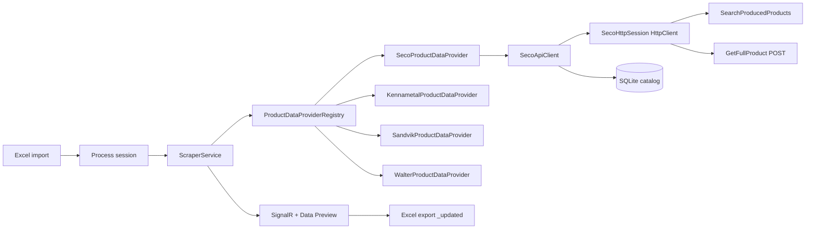

# Auto Tool Catalog

**Version 2.9.0** · Developed by UPECA PDC

A web application that enriches tooling Excel databases with supplier product data. It imports your catalog, fetches specifications from official supplier APIs, stores raw JSON in SQLite, and exports an updated workbook with **dynamic property columns** per supplier. SECO is fully HTTP-based; Kennametal may use a Playwright browser bridge when plain HTTP is blocked.

## Features

- Import Excel (`.xlsx`) with thousands of tooling rows
- Live **Data Preview** table with fixed core columns plus dynamically discovered spec columns (`SECO_DC`, `SECO_APMX`, …)
- **Process / Fetch Specs** — concurrent supplier lookups with real-time progress (SignalR)
- **SECO** — pure HTTP pipeline (`HttpClient` + cookies); designation search via `SearchProducedProducts`, product specs via `GetFullProduct` POST — **no Chromium/Node on the server**
- **Kennametal** — product-config CAD API (`product-config.net`); `KENN_*` columns from CAD parameters
- **Sandvik** — Coromant product search API; `SAND_*` columns from product detail properties
- **Walter** — Walter product search API; `WALT_*` columns from product `columns` + `items[]`
- Progress panel shows **Success / Failed / Current** and elapsed **Time** (`hh:mm:ss`) while processing
- Export completed Excel as `{original_name}_updated.xlsx` (formatted table, hyperlinks on Link)
- Stop processing mid-run; SignalR reconnect re-joins the session

## Tech Stack

| Layer | Technology |
|--------|------------|
| Runtime | .NET 10, ASP.NET Core Razor Pages |
| UI | Bootstrap 5, SignalR |
| Excel | ClosedXML |
| Catalog storage | SQLite (`Data/catalog.db`) |
| SECO data | `SecoHttpSession` — shared `HttpClient` + `CookieContainer` (no browser) |
| Browser bridge (Kennametal) | Playwright/Chromium when plain HTTP is blocked |

## Architecture (v2.0)

The app no longer scrapes HTML with HtmlAgilityPack. Each supplier is handled by a **product data provider** that returns normalized key/value properties.



### SECO pipeline

SECO is **100% HTTP** — no Playwright, no Chromium, no Node.exe. This avoids MonsterASP suspensions when processing SECO rows.

```
Procurement channel / Link / Tool Description
        ↓
Resolve item number (link → master list → SearchProducedProducts → 8-digit ID in text)
        ↓
Warm up session cookies (GET product article page — ARRAffinity, TrackSessionId, …)
        ↓
POST GetFullProduct (itemNumber + market + language) → JSON with Attributes[]
        ↓
Save raw JSON → SQLite (raw_products)
        ↓
Normalize Attributes[] → SECO_{Name} columns
        ↓
Save attributes → SQLite (product_attributes)
        ↓
Merge into session → UI + export
```

**Master list** (`Data/SECO_GLOBAL_ID.xlsx`, ~1,000 tools) is seeded once into a SQLite table (`seco_global_ids`) and loaded into an in-memory dictionary at startup (`SecoGlobalIdStore`). A `Tool Description → Seco Global Number` hit resolves the item number with no network call. The Excel is re-seeded only when it changes (a length+mtime signature is stored in `app_meta`).

**Designation search** (when Link and master list both miss) uses SECO’s catalog API:

```
GET https://www.secotools.com/core/api/Products/SearchProducedProducts?searchTerms={designation}
```

Returns `[{ "ItemNumber": "02968233", "Designation": "JH142040G2R100.0Z4-HXT", … }]`. When multiple variants exist (e.g. `NR…`, `R…` prefixes), the app picks an **exact designation match**.

**Product fetch** uses a session-warmed POST:

| Step | Request |
|------|---------|
| 1. Warmup | `GET https://www.secotools.com/article/p_{itemNumber}` |
| 2. Fetch | `POST https://www.secotools.com/core/api/Products/GetFullProduct` |

POST body (`application/x-www-form-urlencoded`):

```
itemNumber=02968233
market=MY
language=en-GB
```

Required headers include `X-Requested-With: XMLHttpRequest`, empty `X-Seco-api`, `Referer` (article page), and `Origin: https://www.secotools.com`. Market and language are configurable in `appsettings.json` under `Seco:Market` and `Seco:Language` (defaults: `MY`, `en-GB`).

Example product page: `https://www.secotools.com/article/p_02968233`

| SECO row type | Typical speed |
|---------------|---------------|
| Link or master-list match | ~0.3–3 s per row |
| Designation-only (SearchProducedProducts + GetFullProduct) | ~1–5 s per row |

To add coverage, append rows to `Data/SECO_GLOBAL_ID.xlsx` (columns: `Seco Global Number`, `Tool Description`); the table re-seeds on next startup. Rows that miss everything fail with a clear “could not resolve item number” error.

### Kennametal pipeline

```
Link (…5672870.html) or Tool Description (e.g. 5720VZ16-A063Z4R)
        ↓
Resolve numeric product ID (URL → Hybris search API → HTML search → Playwright fallback)
        ↓
GET https://www.product-config.net/catalog3/cad?d=kennametal&id={productId}
        ↓
Pair attributes[] with attributeValues[] → KENN_{cadParameterName}
        ↓
SQLite + UI + export
```

Hybris search (ISO catalog number → product `code`):  
`GET https://www.kennametal.com/ws/v2/kmt/products/search?query={part}:relevance&fields=FULL`

Product pages look like:  
`https://www.kennametal.com/us/en/products/p.5720-series-shell-mill-metric.5672870.html`

### Sandvik pipeline

```
Link (…m=8917817) or Tool Description
        ↓
Resolve material ID (URL → autocomplete API by order code)
        ↓
GET https://www.sandvik.coromant.com/api/productsearch/product?id={materialId}
        ↓
Map properties[] (isDetails) → SAND_{title} with units
        ↓
SQLite + UI + export
```

Product pages look like:  
`https://www.sandvik.coromant.com/en-gb/product-details?c=1K354-1000-XD%201730&m=8917817`

### Walter pipeline

```
Link (/search/product/{id}) or Tool Description (first token, lowercased)
        ↓
GET https://www.walter-tools.com/api/productsearch/getproduct?id={id}&measurementUnit=Metric&language=en-gb
        ↓
Require hitCount > 0; map columns[] (showInDetails/showInList) → WALT_{title} from first items[]
        ↓
SQLite + UI + export
```

Product pages look like:  
`https://www.walter-tools.com/en-gb/search/product/dc180-05-05.500a1-wj30ez`

Ordering codes in Excel (e.g. `DC165-05-08.000A1-WJ30UU`, `F2162-8`, `A3289DPL-12`) are passed as lowercase `id` values. If Walter returns `hitCount: 0`, the row fails with **Walter product not found**.

### TaeguTec (HTTP HTML catalog)

Rows with procurement channel **TAEGUTEC** (or any value containing `TAEGU`) fetch specs from the IMC e-catalog. The session warms `Index.aspx` for the ASP.NET cookie, then either uses a full **Link** (`Item.aspx?cat=…&fnum=…&mapp=…`) or resolves `fnum`/`mapp` from `search.aspx?cat={catalogNo}&stype=1&styp=E` before loading `Item.aspx`. Visible ISO13399 parameters from `content_gvwItemParameters` map to **`TAEG_*`** columns (e.g. `TAEG_DC`, `TAEG_OAL`).

**Catalog number resolution** (same pattern as SECO global IDs): `Data/TAEGUTEC_CATALOG_NO.xlsx` is seeded into SQLite at startup. For designation-only rows, **Tool Description** is looked up in the master list to get **Catalog No**, then the live item page is fetched. Catalog number can also come from **Link** (`cat=` query) or a 6–8 digit token in the description.

**Cloudflare + Browserbase:** the IMC site is Cloudflare-protected and returns a 403 JS challenge to plain `HttpClient` from most IPs. Set a **Browserbase** API key (`TaeguTec:BrowserbaseApiKey` in `appsettings.json`, or the `BROWSERBASE_API_KEY` env var) to fetch via a Browserbase cloud browser, which passes the challenge automatically. The browser runs in Browserbase's cloud over a CDP WebSocket, so **no Chromium/Playwright driver is needed on the server** — this works on MonsterASP. Without a key, TaeguTec falls back to plain HTTP (which fails wherever Cloudflare blocks). The active mode is logged at startup.

Browserbase caps concurrent sessions per plan (free = 3). `TaeguTec:BrowserbaseMaxConcurrency` (default `2`) gates how many cloud-browser sessions run at once; `429 Too Many Requests` is retried with exponential backoff. Raise this only if your plan allows more concurrent sessions.

### Dynamic columns

| Supplier | Column prefix | Status |
|----------|----------------|--------|
| SECO | `SECO_` | Live HTTP API (`SearchProducedProducts` + `GetFullProduct`) |
| KENNAMETAL | `KENN_` | Live CAD API (`product-config.net/catalog3/cad`) |
| SANDVIK | `SAND_` | Live product API (`sandvik.coromant.com/api/productsearch`) |
| WALTER | `WALT_` | Live product API (`walter-tools.com/api/productsearch/getproduct`) |
| TAEGUTEC | `TAEG_` | Live HTML catalog via Browserbase cloud browser (`imc-companies.com/taegutec/ttkcatalog`, Cloudflare-protected) |

Legacy fixed columns (Type, Shank/Bore Ø, Tool Ø, Corner rad, Flute length, OAL, Edge count) were removed in v2.0. Extra columns in your source Excel are **ignored** on import.

## Input Excel format

Only these columns are read (headers are matched case-insensitively):

| Column | Aliases | Required |
|--------|---------|----------|
| No. | — | No |
| Tool Description | — | **Yes** (rows without it are skipped) |
| Supplier | **Procurement channel** (if Supplier is not a known vendor name) | Recommended |
| Link | Webpage Link, URL, Product URL, Product Link | No (recommended for SECO; designation-only also works via `SearchProducedProducts`) |

Example layout (your file may have extra columns — they are ignored):

| No. | Tool Description | Type of Tool | … | Procurement channel |
|-----|------------------|--------------|---|---------------------|
| 1 | JH142040G2R100.0Z4-HXT | Solid Endmill | … | SECO |

Supplier must normalize to **SECO**, **KENNAMETAL**, **SANDVIK**, **WALTER**, or **TAEGUTEC** for live API fetch. If the Supplier cell contains a tool type (e.g. “Solid Endmill”), the importer uses **Procurement channel** when it contains a known vendor name.

## Project layout

```
Auto-Tool-Catalog/
├── Data/
│   ├── CatalogRepository.cs      # SQLite: raw_products, product_attributes
│   ├── ICatalogRepository.cs
│   └── catalog.db                # Created at runtime
├── Hubs/
│   └── ProcessingHub.cs          # SignalR: ProgressUpdate, RecordUpdated, ColumnsUpdated
├── Models/
│   ├── ToolRecord.cs             # Core row + Properties dictionary
│   ├── ProcessSession.cs         # Session, SourceFileName, PropertyColumns
│   ├── ProductFetchResult.cs
│   ├── SupplierPrefixes.cs
│   └── Seco/SecoProductDto.cs
├── Services/
│   ├── ExcelService.cs           # Import/export core + dynamic columns
│   ├── ScraperService.cs         # Orchestration, concurrency (5)
│   ├── ProductDataProviderRegistry.cs
│   ├── StubProductDataProvider.cs  # Fallback for unknown suppliers
│   ├── PlaywrightBootstrap.cs    # Chromium install (Kennametal only; skipped when DISABLE_PLAYWRIGHT_INSTALL=true)
│   ├── Seco/
│   │   ├── SecoApiClient.cs
│   │   ├── SecoHttpSession.cs          # shared HttpClient + CookieContainer + SECO API calls
│   │   ├── SecoGlobalIdStore.cs        # master list → SQLite + in-memory lookup
│   │   └── SecoProductDataProvider.cs
│   ├── Kennametal/
│   │   ├── KennametalApiClient.cs
│   │   └── KennametalProductDataProvider.cs
│   ├── Sandvik/
│   │   ├── SandvikApiClient.cs
│   │   └── SandvikProductDataProvider.cs
│   └── Walter/
│       ├── WalterApiClient.cs
│       └── WalterProductDataProvider.cs
├── Models/Kennametal/KennametalCadDto.cs
├── Models/Sandvik/                 # Sandvik API DTOs
├── Tools/
│   ├── SecoApiTest/              # Manual SECO integration test
│   └── KennametalApiTest/        # Manual Kennametal integration test
├── Pages/
│   └── Index.cshtml              # Main UI
└── Program.cs                    # Minimal API + Razor
```

`Tools/**` is excluded from the web project compile and **content** globbing so helper-project `bin` folders are not copied into the main app output (avoids Windows path-too-long nesting). Build tools with:

```bash
dotnet run --project Tools/SecoApiTest/SecoApiTest.csproj
```

Tests designation resolution (`SearchProducedProducts`) and `GetFullProduct` for sample tools including `JH142040G2R100.0Z4-HXT`.

### SECO API reference (v2.7+)

| Purpose | Method | URL | Body / params |
|---------|--------|-----|----------------|
| Resolve designation → item number | GET | `/core/api/Products/SearchProducedProducts?searchTerms={designation}` | — |
| Warm session cookies | GET | `/article/p_{itemNumber}` | — |
| Fetch full product JSON | POST | `/core/api/Products/GetFullProduct` | `itemNumber`, `market`, `language` |

Implementation: `Services/Seco/SecoHttpSession.cs`, `Services/Seco/SecoApiClient.cs`. Migration notes: `.cursor/rules/SECO_Cookie_Harvesting_Migration.md`.

## HTTP API

| Method | Path | Description |
|--------|------|-------------|
| POST | `/api/upload` | Upload `.xlsx`; returns `sessionId` |
| POST | `/api/process/{sessionId}` | Start processing (background) |
| POST | `/api/stop/{sessionId}` | Cancel processing |
| GET | `/api/records/{sessionId}` | Rows + dynamic `columns` |
| GET | `/api/progress/{sessionId}` | Progress DTO |
| GET | `/api/export/{sessionId}` | Download `{basename}_updated.xlsx` |
| GET | `/api/sample` | Sample workbook |

SignalR hub: `/hubs/processing` — join with `JoinSession(sessionId)`; events `ProgressUpdate`, `RecordUpdated`, `ColumnsUpdated`.

## Prerequisites

- [.NET 10 SDK](https://dotnet.microsoft.com/download)
- Windows, Linux, or macOS
- **Playwright/Chromium** — only needed locally if you process **Kennametal** rows (SECO does not use a browser). On MonsterASP, set `DISABLE_PLAYWRIGHT_INSTALL=true` in the control panel.

### Master data files (`Data/`)

| File | Purpose | Key |
|------|---------|-----|
| `SECO_GLOBAL_ID.xlsx` | SECO `Tool Description → Seco Global Number` | Global Number |
| `TAEGUTEC_CATALOG_NO.xlsx` | TaeguTec `Tool Description → Catalog No` | Catalog No |

Seeded into SQLite at startup and re-seeded automatically when the file changes. Append rows and restart to extend SECO or TaeguTec coverage.

## Run locally

```bash
cd Auto-Tool-Catalog
dotnet restore
dotnet run
```

Open the URL shown in the console (e.g. `http://localhost:5000` or `http://localhost:5200`).

### Clean rebuild (if you hit path-too-long errors)

Old builds may have nested `bin/Tools/...` folders. From the project root:

```powershell
# Stop the app, then delete build outputs
Remove-Item -Recurse -Force bin, obj, Tools\SecoApiTest\bin, Tools\SecoApiTest\obj -ErrorAction SilentlyContinue
dotnet build
```

The `.csproj` already excludes `Tools/**` from web content copying; a one-time cleanup is enough after upgrading from pre-2.0.4 builds.

## Configuration

| Setting | Location | Default |
|---------|----------|---------|
| SQLite path | `appsettings.json` → `CatalogDb:Path` | `Data/catalog.db` under content root |
| Max concurrent rows | `ScraperService` | 5 |
| Supplier HTTP clients | `Program.cs` → `AddHttpClient` | `SECO`, `KENNAMETAL`, `SANDVIK`, `WALTER` |
| SECO market | `appsettings.json` → `Seco:Market` | `MY` |
| SECO language | `appsettings.json` → `Seco:Language` | `en-GB` |
| SECO HTTP session | `Program.cs` → `AddSingleton<SecoHttpSession>()` | One shared `CookieContainer` per app |
| Playwright install | Env `DISABLE_PLAYWRIGHT_INSTALL` or `Playwright:InstallOnStartup` | Skipped on production / MonsterASP |

## Error handling

| Case | Behavior |
|------|----------|
| Unknown supplier | Row fails; error on fetch result |
| SECO: cannot resolve item / JSON | Row fails |
| SECO: empty attributes | Row fails |
| SECO: 401/403 on GetFullProduct | Session re-warmed and retried once |
| Kennametal / Sandvik / Walter: cannot resolve ID or empty response | Row fails |
| Walter: `hitCount: 0` | Row fails (**Walter product not found**) |
| Unknown / stub supplier | Success with no properties; dynamic cells show `#N/A` when columns exist |
| User stop | `OperationCanceledException`; partial results kept |

## Adding a new supplier API

1. Add a constant and prefix in `Models/SupplierPrefixes.cs`.
2. Implement `IProductDataProvider` (see `SecoProductDataProvider` or `StubProductDataProvider`).
3. Register in `ProductDataProviderRegistry` (`Program.cs` DI already registers the registry).
4. Map any new properties in the provider; `ScraperService` will add columns to `session.PropertyColumns` automatically.

Do **not** place new tool projects under `Tools/` without keeping the `Content Remove="Tools/**"` entries in `AutoToolCatalog.csproj`.

## Publish for production

```powershell
.\scripts\publish-for-ftp.ps1
```

Output folder (default): `C:\Users\Public\Documents\Auto-Tool-Catalog\publish_clean`

The script publishes Release DLLs (`UseAppHost=false`), removes `.playwright` binaries, and is ready for MonsterASP upload. SECO rows work without Chromium on the server.

Or publish manually:

```bash
dotnet publish AutoToolCatalog.csproj -c Release -o ./publish -p:UseAppHost=false
```

Production hosts need Chromium only if you rely on **Kennametal** browser fallback (not SECO).

### Deploy to MonsterASP.NET (FTP / manual)

Web Deploy is optional; **FTP + manual upload** is the supported path for this host.

**1. Build locally (or use GitHub Actions)**

```powershell
.\scripts\publish-for-ftp.ps1
```

Output folder (default): `C:\Users\Public\Documents\Auto-Tool-Catalog\publish_clean`

Or publish manually:

```bash
dotnet publish AutoToolCatalog.csproj -c Release -o "C:\Users\Public\Documents\Auto-Tool-Catalog\publish_clean" -p:UseAppHost=false
```

On GitHub: **Actions → “Build for MonsterASP.NET (FTP)” →** download the **monsterasp-publish** artifact from the latest run.

**2. Copy files into `wwwroot`**

Use [WebFTP](https://webftp.monsterasp.net) or any FTP client:

| Setting | Value |
|---------|--------|
| Host | `site72127.siteasp.net` (use hostname, not IP) |
| Port | `21` (FTP) |
| Login | your site login |
| Remote folder | `wwwroot` (or the folder that already contains your site files) |

Upload **everything inside** `publish_clean` (e.g. `AutoToolCatalog.dll`, `web.config`, `Data/SECO_GLOBAL_ID.xlsx`) into that remote folder. Do not upload an extra nested folder unless you intend the site URL to include that path.

**3. Optional: GitHub Actions FTP upload**

Add repository secrets: `FTP_SERVER` (`site72127.siteasp.net`), `FTP_USERNAME`, `FTP_PASSWORD` (FTP password, not Web Deploy).

Run the workflow manually (**Actions → Run workflow**) and check **Deploy to FTP**. If files land in the wrong place, edit `server-dir` in `.github/workflows/deploy.yml` — use `./` when FTP already opens inside `wwwroot`.

**4. MonsterASP control panel (required)**

| Setting | Use |
|---------|-----|
| .NET version | **.NET 10** |
| Hosting model | **InProcess** (not OutOfProcess) |
| Application | **DLL** / `dotnet` — `AutoToolCatalog.dll` via `web.config` |
| `DISABLE_PLAYWRIGHT_INSTALL` | **`true`** — SECO uses HttpClient only; prevents Node.exe/Chromium install on startup |
| `ASPNETCORE_ENVIRONMENT` | **`Production`** (if offered) |

Do **not** upload `AutoToolCatalog.exe` or run the site as a standalone EXE in **OutOfProcess** mode — MonsterASP will disable the app pool with *AppPool [site72127] is not enabled on server* ([ASP.NET Core hosting models](https://help.monsterasp.net/books/websites/page/aspnet-core-hosting-model-support)).

If the pool is already disabled, open a **support ticket** in the MonsterASP panel and ask them to **re-enable application pool site72127** (you cannot turn it back on yourself after a crash).

After re-enable: republish with `.\scripts\publish-for-ftp.ps1`, upload `web.config` + `AutoToolCatalog.dll` + dependencies (no `.playwright` folder). Confirm `DISABLE_PLAYWRIGHT_INSTALL=true` and `ASPNETCORE_ENVIRONMENT=Production` in the panel.

### Docker (optional)

```dockerfile
FROM mcr.microsoft.com/dotnet/aspnet:10.0 AS runtime
WORKDIR /app
COPY ./publish .
ENTRYPOINT ["dotnet", "AutoToolCatalog.dll"]
```

```bash
dotnet publish -c Release -o ./publish
docker build -t auto-tool-catalog .
docker run -p 8080:8080 -e ASPNETCORE_URLS=http://+:8080 auto-tool-catalog
```

### IIS (Windows)

1. `dotnet publish -c Release -o C:\inetpub\AutoToolCatalog -p:UseAppHost=false`
2. Application Pool: **No Managed Code**
3. Install [ASP.NET Core Hosting Bundle](https://dotnet.microsoft.com/download/dotnet/10.0)
4. SECO rows need **no browser**. Plan for Playwright/Chromium only if using Kennametal browser fallback.

## Changelog

See [CHANGELOG.md](CHANGELOG.md) for version history (2.7.x = SECO HttpClient migration; 2.6.0 = TaeguTec; 2.5.x = MonsterASP FTP deploy; 2.4.0 = SECO master list; 2.3.0 = Walter; 2.2.0 = Sandvik; 2.1.0 = Kennametal; 2.0.0 = API/SQLite/dynamic columns).

## License

MIT
